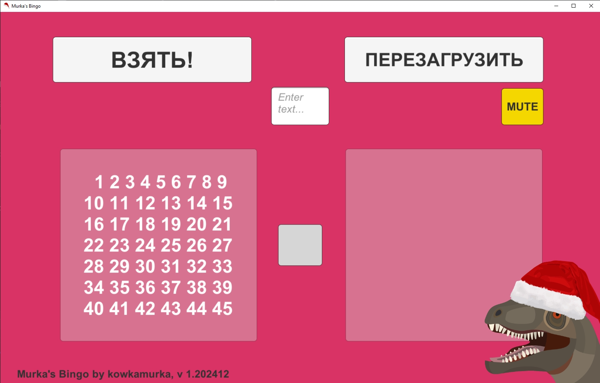

# Eng

## Scripts and other staff to my mini bingo.

---

The utility was created and used for the lottery I held on my YouTube channel for every New Year.

I drew, animated, scripted and assembled everything in Unity myself.

This is what it looks like in reality:

The latest version of the utility is available in releases.

> Unfortunately, I don't remember the structure of the project in Unity well, so I put together only the most necessary things and something I'm not sure about in the commit.

---

# Rus

## Скрипты и прочий стаф к моему мини-бинго.

---

Утилиту создал и использовал для розыгрышей, которые проводил на своём YouTube-канале под каждый Новый год.

Всё нарисовал, анимировал, заскриптовал и собрал сам. 

Вот так эта штука выглядит в реальности:

Последняя версия утилиты доступна в релизах. 

> К сожалению, уже не очень хорошо помню структуру проекта в Unity, поэтому собрал в коммит только самое необходимое и кое-что, в чём не уверен.

